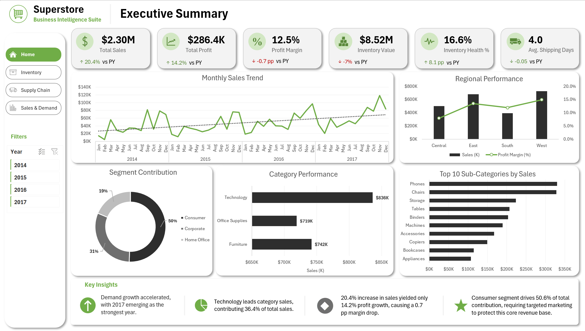
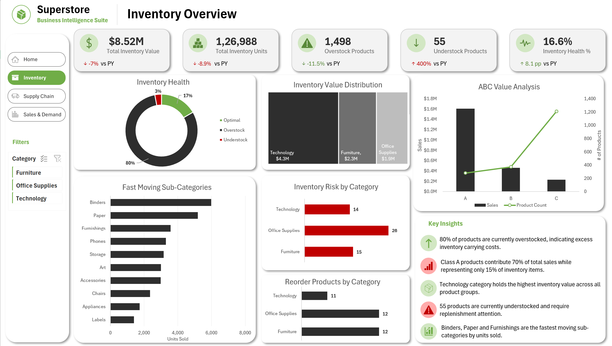
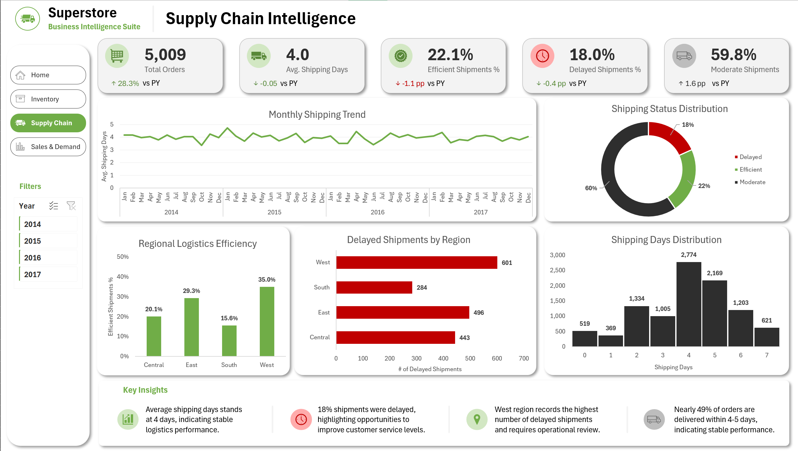
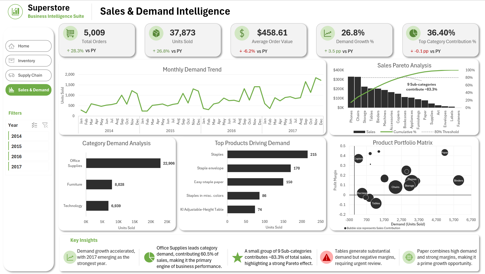

# 📊 Retail Business Intelligence Suite

A comprehensive **Excel-based analytics solution** delivering actionable insights across sales performance, inventory optimization, supply chain efficiency, and product demand — built for a retail organization (modeled on a Superstore chain).

The suite consists of **four interconnected dashboards** — Executive Summary, Inventory Overview, Supply Chain Intelligence, and Sales & Demand Intelligence — enabling retail managers to quickly assess key business metrics and identify improvement areas, all within a single interactive workbook.

---

## 🚀 Key Features / Highlights

- **Four fully interconnected dashboards** with a shared navigation menu and consistent design language
- **Dynamic slicers** (Year, Category) that filter KPIs and charts simultaneously across relevant pages
- **DAX-powered measures** — Average Shipping Days, Profit Margin, Delayed Shipments, Efficient Shipments, Reorder Products — layered on top of PivotTable-driven calculations
- **ABC Analysis** classifying products by sales contribution vs. inventory footprint
- **Simulated inventory model** (Opening Stock, Reorder Point, Inventory Health) engineered from a sales-only dataset using rule-based logic
- **Pareto (80/20) analysis** identifying the small set of products driving the majority of sales
- **Product Portfolio Matrix** — a bubble chart plotting profit margin against demand, sized by sales contribution, to flag high-volume/low-margin risk products
- **Auto-updating KPI cards** with year-over-year variance indicators (▲/▼) and custom number formatting (K, M, %, pp)
- **One-click data refresh** via Power Query and the Excel Data Model — no manual recalculation needed

---

## 🖥️ Dashboard Pages

### 1. Executive Summary
A high-level command center for leadership. Displays core KPIs — Total Sales, Profit, Profit Margin, Inventory Value, Inventory Health %, and Avg. Shipping Days — each benchmarked against the prior year. Includes a monthly sales trend line, regional performance (sales vs. margin), segment contribution, category performance, and a Top 10 Sub-Categories ranking, paired with a dynamic Key Insights panel.

### 2. Inventory Overview
A stock-health control tower. Features an Inventory Value treemap by category, an Inventory Health donut (Overstock / Optimal / Understock), an ABC value analysis combo chart, fast-moving sub-categories, inventory risk by category, and a reorder list to flag products needing replenishment.

### 3. Supply Chain Intelligence
An order-fulfillment diagnostics view. Tracks average shipping days over time, the on-time vs. delayed vs. moderate shipment split, regional logistics efficiency, delayed shipments by region, and the full shipping-days distribution — surfacing which regions need operational attention.

### 4. Sales & Demand Intelligence
A demand-pattern deep dive. Combines a monthly demand trend, a Sales Pareto chart (cumulative % of sales by sub-category), category demand analysis, top products driving demand, and a Product Portfolio Matrix (profit margin vs. demand, bubble size = sales) to spotlight growth opportunities and margin risks.

---

## 💡 Key Insights (Sample Business Findings)

- **Revenue momentum is building** — sales grew 20.4% year-over-year, with 2017 emerging as the strongest year on record, signaling accelerating demand rather than a one-off spike.
- **Growth is outpacing profitability** — the 20.4% sales increase translated into only 14.2% profit growth, compressing margin by 0.7 percentage points; cost structure or discounting deserves a closer look.
- **Technology is the volume driver, Consumer is the revenue base** — Technology contributes 36.4% of category sales, while the Consumer segment alone accounts for over 50% of total revenue, making it the single most important segment to protect.
- **Inventory is significantly over-invested** — 80% of products are classified as overstocked, tying up an estimated $8.5M in inventory value; current reorder points are too conservative for actual sell-through rates.
- **A small SKU set carries the business** — Class A products contribute roughly 70% of total sales while representing just 15% of inventory items, reinforcing the case for tighter ABC-driven stocking policy.
- **Logistics performance is stable but regionally uneven** — average shipping time holds steady at 4 days, yet the West region accounts for the highest share of delayed shipments (~601 orders), pointing to a localized fulfillment bottleneck.
- **Demand concentration confirms the Pareto principle** — just 9 sub-categories drive approximately 83% of total sales, an actionable signal for where to focus procurement and marketing spend.
- **Some high-volume products erode margin** — items like Tables generate strong demand but sit at negative profit margin, flagging a need to renegotiate supplier costs or reprice.

> *Insight boxes are dynamically generated within the dashboard based on the active slicer/filter context.*

---

## 🗂️ Dataset Description

- **Source**: A retail transactional dataset modeled on the widely-used **Superstore** dataset (Order Date, Ship Date, Product ID, Category, Sub-Category, Sales, Quantity, Profit, Customer, Region, Segment, etc.)
- **Data Model**: Built using `Fact_Orders` and `Products_Master` tables connected through Excel's native Data Model (Power Pivot)
- **Inventory Simulation**: Since the source dataset contains no native inventory records, inventory fields were derived using documented business assumptions:
  - **Opening Stock** manually assigned per product
  - **Reorder Point (ROP)** = Opening Stock × 20%
  - **Inventory Status** (In Stock / Reorder / Out of Stock) and **Inventory Health** (Overstock / Optimal / Understock) calculated via rule-based Excel logic
- **Calculation Approach**:
  - **DAX measures** (used sparingly): Avg. Shipping Days, Profit Margin, Delayed Shipments, Efficient Shipments, Reorder Products
  - **PivotTables / Excel formulas** handle everything else: YoY comparisons, Inventory Value, Inventory Health %, ABC Analysis, Sales Growth %, KPI variance indicators, and dynamic insight text

*Note: Inventory figures are simulated for demonstration purposes — the goal is to showcase inventory analysis methodology on top of a sales-only dataset, not to represent real stock levels.*

---

## 📖 How to Use

1. **Open the workbook** — launch the `.xlsx` file in Microsoft Excel (Excel 365 recommended for full Power Query / Power Pivot support).
2. **Refresh the data** — if underlying source data changes, go to `Data → Refresh All`. PivotCharts and KPI cards will update automatically through the Data Model.
3. **Navigate** — use the left-hand menu (Home, Inventory, Supply Chain, Sales & Demand) to move between dashboards.
4. **Filter** — apply the Year and Category slicers to drill into specific time periods or product categories; all visuals on the page update simultaneously.
5. **Explore the data** — hover over any chart element to see exact values via Excel tooltips (e.g., cumulative sales % on the Pareto chart).
6. **Read the insights** — each dashboard includes a Key Insights panel summarizing the most actionable takeaways for that page.
7. **Share** — export any dashboard as a PDF for executive reporting, or duplicate the workbook for scenario planning.

---

## 📸 Screenshots

### Executive Summary


### Inventory Overview


### Supply Chain Intelligence


### Sales & Demand Intelligence


---

## 📁 Repository Structure

```
Retail-Business-Intelligence-Suite/
│
├── README.md                          # Project documentation (this file)
├── Retail_BI_Suite.xlsm               # Main Excel workbook (dashboards + data model)
│
├── Data/
│   └── Superstore.csv         # Source transactional data
│
└── Screenshots/
    ├── 1-Executive-Summary.png
    ├── 2-Inventory-Overview.png
    ├── 3-Supply-Chain.png
    └── 4-Sales-&-Demand.png
```

---

## 🛠️ Technologies Used

`Microsoft Excel (365)` · `Power Query` · `Power Pivot` · `DAX` · `PivotTables & PivotCharts` · `Excel Formulas`

---

## 🔮 Future Enhancements

- Automate data ingestion from live sales systems via Power Query connectors
- Add drill-through functionality (e.g., click a region to view city-level detail)
- Port the model to Power BI or Tableau for enhanced interactivity and performance at scale

---

## 👤 Author / Contact

**Abhik Roy**
📧 [your.email@example.com]
🔗 [LinkedIn Profile URL]

---

*If you found this project useful or interesting, consider ⭐ starring the repository!*
